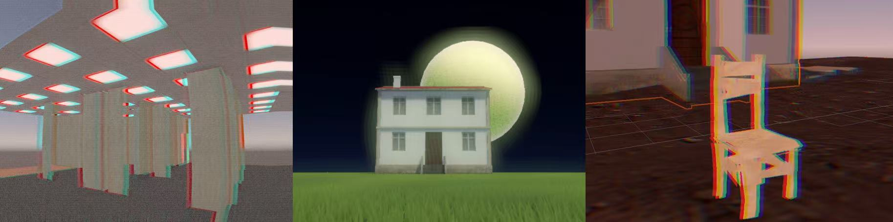
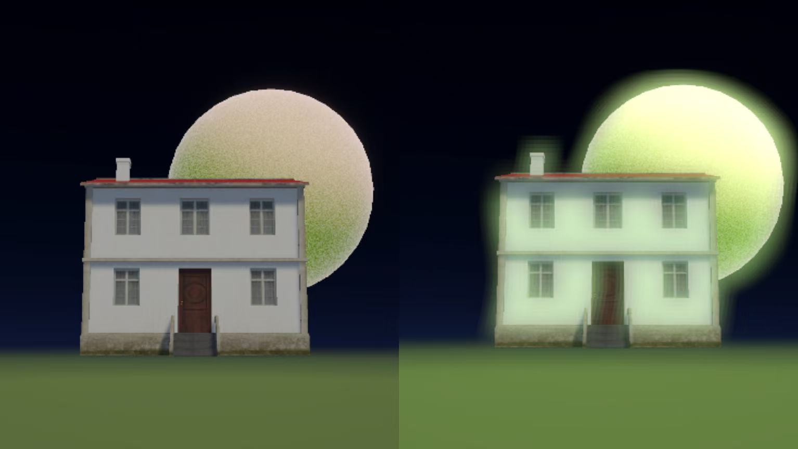

# 👁️ Procedural Rendering of Dreamcore Aesthetics in Unity

> A highly decoupled, procedural rendering pipeline built for **Unity 6 Universal Render Pipeline (URP)** to generate surreal, nostalgic, and unstable *Dreamcore* and *Analog Horror* visual aesthetics.

*Overview of the procedural dreamcore rendering pipeline.*

While traditional computer graphics strive for photorealism, this project demands the opposite. We mathematically model and procedurally generate optical flaws, physical instability, and analog media degradation to evoke psychological unease and spatial ambiguity.

📄 **[Read the Full Technical Report (PDF) Here](./.readme_assets/Procedural Rendering of Dreamcore like Visual Aesthetics in Unity.pdf)**

## Demo Video

The demo video is included in the submitted zip file. It can also be viewed here: [Demo Video](https://drive.google.com/file/d/1KWLCZkfpf6hWcWSy8XnkTSbaX3dlJv3q/view?usp=sharing)

## ✨ Core Technical Features

This project abandons ready-made post-processing assets in favor of a custom-built, mathematically driven rendering architecture. The pipeline consists of three main procedural pillars:

### 1. Analog Media Degradation (Render Graph Post-Processing)
Built upon the latest **Unity 6 URP Render Graph API**, this decoupled `ScriptableRendererFeature` simulates vintage camera flaws without hardcoding the rendering loop.
* **Delta-Addition Chromatic Aberration:** A novel algorithm that extracts and additively blends color variation deltas (ΔR, ΔG, ΔB), ensuring vibrant red/cyan color fringing that isn't masked by heavy environmental color grading.
* **CRT Lens Distortion & Dynamic Pixelation:** Simulates the convex curvature of vintage CCTV monitors, paired with an algorithm that forces continuous UV gradients into distinct blocks to artificially degrade resolution.
* **VHS Signal Interference:** Procedurally generates high-frequency tape jitter, dynamic full-screen noise, and V-Sync tearing driven by a time-based Heaviside step function.

*(a) Standard URP render output ➔ (b) Applied barrel lens distortion & dynamic pixelation ➔ (c) Addition of heavy environmental tinting & delta-addition chromatic aberration ➔ (d) Full analog degradation including high-frequency jitter, dynamic noise, CRT scanlines, and V-Sync tearing.*

### 2. Procedural Geometric Decay (Vertex Displacement)
A custom HLSL shader (`DreamNoiseHX_Lit`) that manipulates mesh geometry at the vertex level, making environments feel as if they are melting or sinking.
* **3D Fractal Brownian Motion (fBm):** Utilizes a two-octave procedural Perlin noise algorithm to generate organic surface erosion and directional structural collapse based on world-space gravity.
* **Real-time Normal Estimation:** Recalculates accurate surface normals on the fly using the finite difference method, ensuring accurate lighting on heavily deformed geometry.
* **Shadow Caster Synchronization:** Custom shadow passes guarantee that cast shadows perfectly match the melting, distorted silhouettes of the objects.

*Visual progression of procedural mesh deformation from rigid geometry to extreme structural collapse.*

### 3. Multi-Scale Stylized Bloom
A custom dynamic bloom module designed for NPR (Non-Photorealistic Rendering) to create a soft, temporal, and flowing glow.
* **Multi-Resolution Compositing:** Extracts bright pixels and processes them through multiple downsampled levels (1/2, 1/4, 1/8 resolution) with separable blur, combining them for a wider, dreamier light spread.
* **Temporal Breathing & UV Flow:** Modulates bloom intensity over time using sine functions and applies a subtle time-based UV offset to make the glowing aura slowly shift and flow independently of the solid geometry.

*Comparison between the original scene and the final composited result with the custom Bloom effect.*

---

## 🚀 Getting Started & Installation

### Prerequisites
* **Unity Version:** Unity 6000.x LTS (or newer)
* **Render Pipeline:** Universal Render Pipeline (URP) with Render Graph enabled.

### Setup Guide
1. Clone the repository and open the project in Unity 6.
2. Ensure your project is using the URP asset configured with Render Graph.
3. Assign the `0_PCrenderer` (or your custom Universal Renderer Data) to your Main Camera.
4. Verify that `DreamcoreRenderFeature` and `DreamyBloomFeature` are added to the Renderer Features list in the inspector.

---

## 🎚️ Real-Time UI Control (Runtime Controller)

To facilitate level design and runtime tweaking, we implemented a robust, decoupled C# UI bridge (`ShaderController.cs`). 

* **Direct GPU Memory Writing:** Bypasses standard URP Volume instantiation issues by writing directly to `Shader.SetGlobalFloat` and static memory blocks, ensuring zero latency and high reliability.
* **In-Game Overlay:** Simply enter Play Mode and use the provided Canvas sliders to dynamically warp the space, increase VHS noise, or melt geometry in real-time.

---

## 👥 Academic Background & Credits

This project was developed as the final project for the **DH2323** course at the **KTH Royal Institute of Technology**, serving as an exploration of procedural graphics and internet aesthetics.

**Core Contributors:**
* **Jili Zhou** - Custom Multi-scale Bloom & Glow Effects
* **Hengxiao Liu** - Noise-based Geometric Displacement Shader
* **Zekai Lin** - Analog Media Degradation & Post-processing Pipeline Architecture
